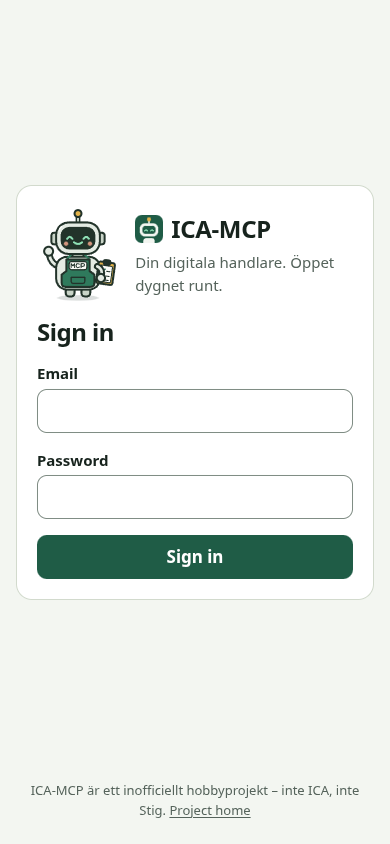
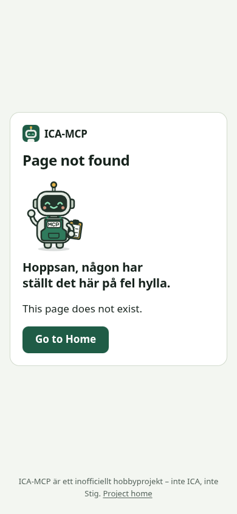
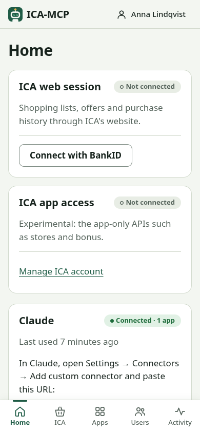
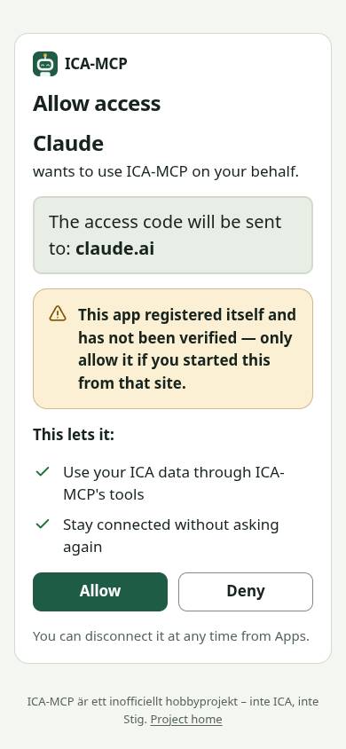
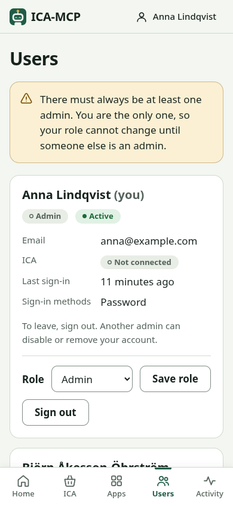
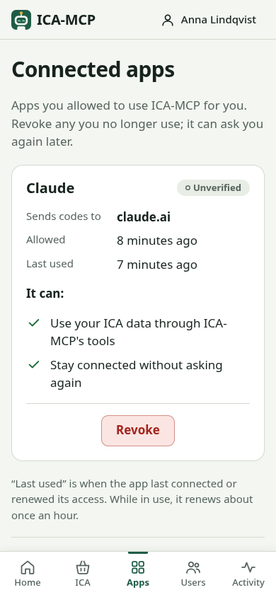
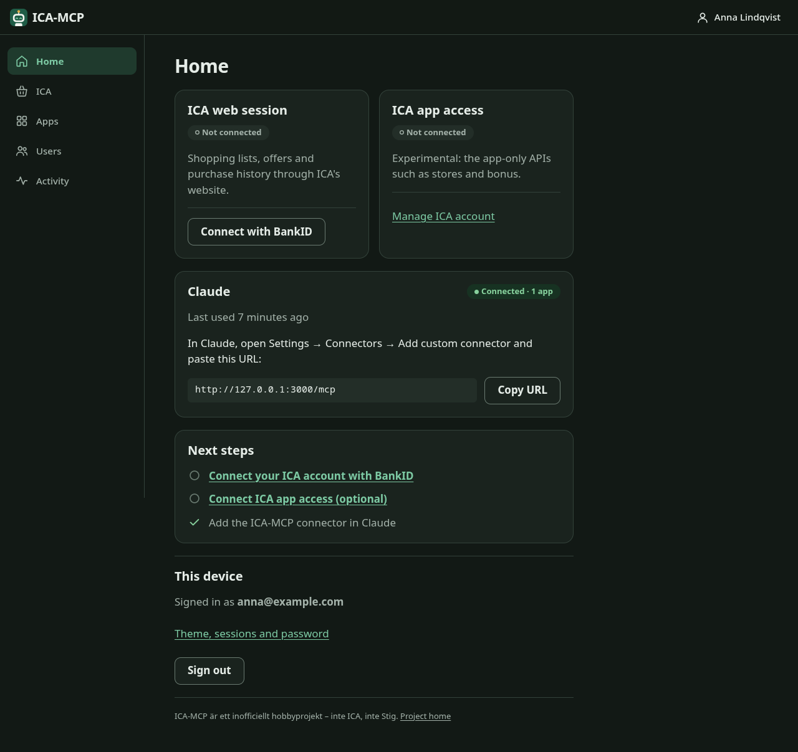
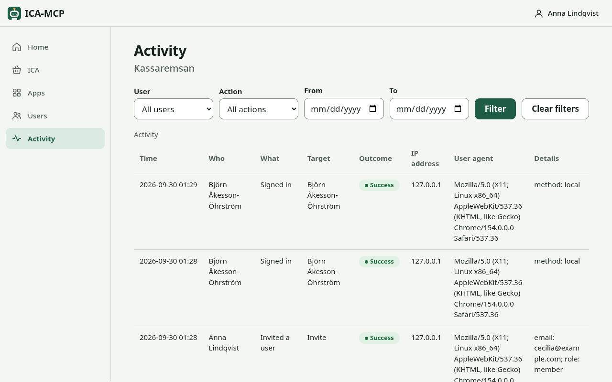

# ica-hub

A self-hosted hub that connects a household's ICA accounts to Claude. It runs on your own server, signs in to ICA
with BankID on your behalf, and exposes ICA shopping lists, offers, purchase history and Handla (online shopping) to
Claude through a remote MCP connector, with its own OAuth sign-in and a small admin UI.

## Status

| Phase | Scope | Status |
| --- | --- | --- |
| 1 | OAuth sign-in for Claude, the MCP connector, BankID connection of an ICA account | Done, deployed |
| 1.5 | Admin UI: mobile-first design, household users with invites and roles, audit log, OIDC sign-in (e.g. Authentik) | Done, deployed |
| 2 | ICA tools for Claude: shopping lists (read and write), stores, offers, bonus, products, catalogue search, purchase history (planned as Phase 3, shipped here), Handla store search and online prices, connection status | **Done, deployed** |
| 4 | Handla cart and delivery slots | Planned |
| 5 | REST API and Home Assistant integration | Planned |

Connecting an ICA account works: the hub relays ICA's BankID QR login server-side, for both the ICA web session and
ICA app access. Claude connects through its custom-connector flow (claude.ai web, then mobile and desktop).

## What you can ask

Once Claude is connected (see [docs/connecting-claude.md](docs/connecting-claude.md)), ask in plain Swedish or
English. The tools, by group:

- **Shopping lists**: read the household's lists and their items (`list_shopping_lists`, `get_shopping_list`), and
  write to them: add, check off, un-check and remove items and create a list (`add_list_items`, `check_list_items`,
  `uncheck_list_items`, `remove_list_items`, `create_shopping_list`). The write tools are off unless the operator
  enables them with `ICA_HUB_LIST_WRITES` (`all`, or a comma-separated list of hub user emails).
- **Offers, stores, bonus and products**: this week's offers at a store (`get_store_offers`), your favourite stores
  with today's opening hours (`get_favorite_stores`), your Stammis bonus (`get_bonus`) and a product by barcode
  (`lookup_product`).
- **Catalogue search**: ICA's article names, as the app suggests them when you add to a list (`search_articles`).
- **Purchase history**: the months with purchases and their totals (`get_purchase_months`), and one month's receipts
  (`get_purchases`: date, store, total and discount per purchase; ICA gives no line items here). ICA only shows it
  for a while after a **fresh web BankID login**: plan on about 30 minutes, although it can last a few hours.
- **Handla**: find stores that sell online for a postcode (`handla_find_stores`) and search a store's online prices
  (`handla_search_products`). Read-only: no cart, no delivery slots (Phase 4).
- **Connection status**: whether ica-hub can reach your ICA account right now and whether purchase history is
  available (`get_session_status`).

Examples: "What's on our shopping list?", "Add milk and 6 eggs", "What's on offer with kyckling at our store?", "How
much bonus do I have?", "What did I spend at ICA in August?".

## When Claude says to reconnect

ica-hub holds two ICA sessions per person, and each message from Claude names the button to press on
`https://<your host>/admin/ica`:

| Claude says | Why | Button on /admin/ica |
| --- | --- | --- |
| No ICA account is connected | You have not connected ICA yet | **Connect with BankID**, then **Connect app access with BankID** |
| The ICA web session has ended | The web session (catalogue search, purchase history) is logged out | **Reconnect with BankID** |
| ICA app access is not connected, or has ended | Lists, stores, offers, bonus and products need app access | **Connect app access with BankID** or **Reconnect app access with BankID** |
| ICA shows purchase history only for a while after a web BankID login | The web session works but is no longer "fresh" enough for purchase history | **Reconnect with BankID** (a fresh web BankID login), then ask again within about 30 minutes |

Order matters for purchase history: an app access BankID login ends the web session's fresh state at once, so if you
need both, reconnect app access first and the web session last. Messages that say "try again" (ICA did not answer,
ICA is limiting requests, ica-hub's per-user limit on ICA calls is used up, Handla is still preparing results) need no reconnect.

## Features

| Feature | Status |
| --- | --- |
| OAuth 2.1 authorization server for Claude (discovery, dynamic client registration, PKCE, refresh) | Available |
| Admin UI: sign-in, consent, ICA account connection | Available |
| Connect an ICA account with BankID (QR or "open on this device") | Available |
| ICA diagnostics page (status codes and response shapes, never values) | Available |
| Health check and Prometheus metrics | Available |
| Household users with invites and roles | Available |
| Audit log | Available |
| OIDC sign-in (e.g. Authentik) | Available |
| Strict CSP, no third-party assets | Available |
| Shopping lists: read, add, check off, remove, create (shared household lists; writes behind `ICA_HUB_LIST_WRITES`) | Available |
| Stores, weekly offers, bonus, product lookup, catalogue search | Available |
| Purchase history (receipt totals per purchase, after a fresh web BankID login) | Available |
| Handla: store search and online prices | Available |
| Handla: cart and delivery slots | Planned (Phase 4) |
| REST API and Home Assistant integration | Planned (Phase 5) |

## Requirements

- A **Swedish IP address** for the server: ICA's login and APIs are meant to be used from Sweden.
- An **ICA account with BankID** for each household member who connects ICA.
- **Your own domain with HTTPS**, reachable from the internet (Claude connects to it), behind a reverse proxy
  without an SSO gate on this vhost.
- Docker, or a Debian 13 host or LXC (the installer sets up Node.js 24).

## Quick start

Every release ships two ways to install. Both need the requirements above; the full guide, with upgrades, backups
and the reverse proxy, is [docs/deployment.md](docs/deployment.md).

### A. Docker

The image `ghcr.io/jonasthim/ica-mcp` is built for linux/amd64 and linux/arm64 (Raspberry Pi 4/5 with a 64-bit OS).
A minimal `compose.yaml` (the repository's [compose.yaml](compose.yaml) lists every optional setting):

```yaml
services:
  ica-hub:
    image: ghcr.io/jonasthim/ica-mcp:latest
    restart: unless-stopped
    stop_grace_period: 30s # shutdown can take up to 20 s; Docker's default 10 s could force a BankID reconnect
    ports: ["3000:3000"]
    environment:
      ICA_HUB_URL: https://ica.example.com # the public https origin
      ICA_HUB_MASTER_KEY: ${ICA_HUB_MASTER_KEY} # openssl rand -base64 32, back it up
      ICA_HUB_AUTH_SECRET: ${ICA_HUB_AUTH_SECRET} # openssl rand -base64 32
      TRUST_PROXY: "1" # number of reverse proxies in front
    volumes: ["ica-hub-data:/data"]
volumes:
  ica-hub-data:
```

Put the two secrets in a `.env` file next to it, then `docker compose up -d`. To pin a version instead of following
`latest`, use a release tag: `:0.2.0` (exactly that release) or `:0.2` (the newest 0.2.x). Releases and their notes
are on the [releases page](https://github.com/jonasthim/ica-mcp/releases).

### B. Debian 13 host or LXC (systemd, no Docker)

As root on a fresh Debian 13 machine or container:

```bash
curl -fsSL https://github.com/jonasthim/ica-mcp/releases/latest/download/install.sh | ICA_HUB_URL=https://ica.example.com bash
```

It downloads the latest release, verifies its checksum, builds it with Node.js 24 in `/opt/ica-hub`, generates the
secrets into `/etc/ica-hub/env` and starts the `ica-hub` systemd service. Run the same command again to upgrade.

To check the installer before running it:

```bash
curl -fsSLO https://github.com/jonasthim/ica-mcp/releases/latest/download/install.sh
curl -fsSLO https://github.com/jonasthim/ica-mcp/releases/latest/download/SHA256SUMS
sha256sum -c --ignore-missing SHA256SUMS   # expect: install.sh: OK
less install.sh
ICA_HUB_URL=https://ica.example.com bash install.sh
```

### Then

1. Open `https://<your host>/admin`, enter the setup code from the service log (`docker compose logs ica-hub` or
   `journalctl -u ica-hub`), and create the first admin (or set up single sign-on first). Then open **ICA account**
   and connect with BankID.
2. Connect Claude: follow [docs/connecting-claude.md](docs/connecting-claude.md).

What is known about ICA's endpoints is in [docs/api-notes.md](docs/api-notes.md). Changes per release are in
[CHANGELOG.md](CHANGELOG.md).

## Screenshots

| Sign in (phone) | Page not found (phone) |
| --- | --- |
|  |  |

| Home, connected (phone) | Allow access (phone) |
| --- | --- |
|  |  |

| Users (phone) | Connected apps (phone) |
| --- | --- |
|  |  |

**Home, connected — desktop, dark theme**



**Activity — desktop**



Screenshots use invented data (an `example.com` admin on a throwaway instance).

## Security

- **Secrets are encrypted at rest.** ICA sessions and tokens are stored AES-256-GCM encrypted with
  `ICA_HUB_MASTER_KEY`, which never lives in the database.
- **Tokens are never logged.** Authorization headers, cookies, passwords and OAuth tokens are redacted from logs, and
  the diagnostics page shows response shapes (keys and types), never values.
- **The consent page shows where the code goes.** Before you allow an app, it shows the host that will receive the
  authorization code and flags self-registered clients as unverified.
- **The admin login is rate-limited** per IP and per email. Password sign-in is only reachable through the admin
  UI; Better Auth's own sign-in and sign-up HTTP endpoints are not exposed.
- Report security issues privately to the maintainer rather than in a public issue.

## ICA terms

- **ICA-MCP** is this project's name in its own admin UI (the sign-in page, the app's top bar and footer); the
  repository and package stay `ica-hub`. The app's own footer says it plainly: *"ICA-MCP är ett inofficiellt
  hobbyprojekt – inte ICA, inte Stig"* — an unofficial hobby project, not ICA, not Stig.
- For **private, non-commercial use** only.
- **ICA has no public API.** This project talks to the same private endpoints ICA's own website and app use.
- It **may break at any time**, whenever ICA changes something.
- It is **not affiliated with, endorsed by or supported by ICA**.
- ICA's app terms forbid reverse engineering the app. You are responsible for how you use this software with your
  own ICA account.

### The shipped ICA app DCR credential

`src/ica/endpoints.ts` contains a client credential for ICA's dynamic client registration (DCR). It is not a secret
of this project or of any user: it is the public client credential distributed in ICA's own app, also used by
existing open-source ICA clients. It only lets a client register itself with ICA's login service; signing in still
requires the account holder's BankID. If ICA rotates it, set `ICA_APP_DCR_CLIENT_SECRET` to override it.

## License

MIT, see [LICENSE](LICENSE).
